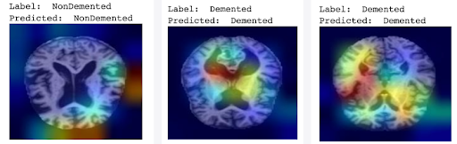

# 🧠 MRI Classifier for Alzheimer's Disease

## Introduction
In this project convolutional neural networks will be applied on a dataset of MRI images with the aim of generating a model capable of predicting the degree ofAlzheimer's disease of any patient. We will focus on the detection of Alzheimer's disease and its different degrees based on 2D images of Magnetic Resonance Imaging(MRI) scans.

Furthermore, a grad-camera will be applied to the model in order to visualize the areas of the image that have been more relevant for the classification.

  

Example of results:

  

## 📊 Dataset
 The dataset has been obtained from the Kaggle platform which contains MRI images in zenith plane of different people separated into four classes. These classes are "NonDemented", "VeryMildDemented", "MildDemented" and "ModerateDemented" where each one represents the degree of Alzheimer's of the patient. 

The dataset itself separates the images into two folders: train (5121 instances) and test (1279 instances), which will be used to train and test the convolutional network respectively.

